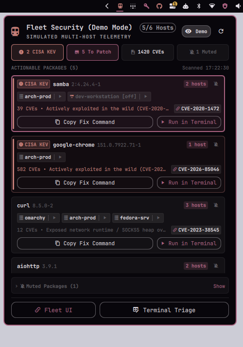

# Omarchy Fleet Security Plugin

[](https://omarchy.org/)
[](https://fleetdm.com/)
[](https://www.cisa.gov/known-exploited-vulnerabilities-catalog)
[](LICENSE)

A high-performance, native vulnerability triage monitor and **FleetDM / osquery** fleet security widget built specifically for the [Omarchy](https://omarchy.org/) desktop environment.



---

## Features

- 🛡️ **Active CISA KEV 0-Day Detection**: Cross-references detected CVEs in real-time against CISA's *Known Exploited Vulnerabilities* (KEV) catalog. Actively exploited zero-days are surfaced with high-urgency badges and prioritized at the top of your triage list.
- 📊 **C-Level Posture Stat Strip**: High-density 34px telemetry strip displaying KEV exploit status (`0 KEV (Safe)`), total prioritized actionable packages (`To Patch`), and aggregate CVE count across your entire fleet.
- 🖥️ **Smart Host Attribution & Remediation**: Automatically identifies which machines run vulnerable packages (e.g., `omarchy`, `arch-prod`, `dev-workstation`, `windows-runner`). Clicking a host chip generates the exact host-tailored command:
  - Local host: `pacman -Syu <pkg>` / `apt update && apt install ...`
  - Remote Linux host: `ssh <host> "pacman -Syu <pkg>"`
  - Windows host: `ssh <host> "winget upgrade --id <pkg>"`
- 📋 **Zero-CLS Instant Clipboard Copying**: Click any "Copy Fix" button or host chip to instantly copy the command to your Wayland clipboard (`wl-copy`), complete with instant visual checkmark feedback and zero layout shift.
- 💻 **Floating Interactive Terminal Triage**: Click **Terminal Triage** to launch an Omarchy-styled floating terminal running the deep 4-tier decision engine:
  - **Tier 1**: Critical CISA KEV active zero-days
  - **Tier 2**: Action Recommended (network-facing runtimes like `aiohttp`, `undici`, `openssl`, `nginx`, `docker`)
  - **Tier 3**: Low / Local-only (offline parsers requiring untrusted input)
  - **Tier 4**: Likely False Positives (rolling release epoch mismatches)
- 🌐 **One-Click Fleet Web UI**: Quick-launch the FleetDM web console directly filtered to vulnerable software (`/software?vulnerable=true`), with auto-discovery of your Tailscale IP or custom Fleet server address.
- ⌨️ **Vim & Keyboard Navigation**: Traverse vulnerable packages with `Up`/`Down`, press `Enter` to copy remediation, press `R` to force-refresh telemetry, and `Esc` to close.
- 🔗 **NIST NVD Deep Linking**: Every vulnerability card and terminal advisory includes direct links to official NIST National Vulnerability Database (NVD) CVE detail pages. Click the `[ 󰌹 NVD ]` button on any card, click the inline `[ 󰌹 CVE-XXXX-XXXXX ]` pill, or click hyperlinks in modern terminals (`ghostty`, `foot`, `alacritty`, `kitty`) to immediately review CVSS scores, vector strings, and technical writeups.
- 🔕 **Vulnerability Mute & Ignore System**: Silence known false positives, internal-only tools, or rolling-release epoch mismatches (e.g. Arch `2:7.1-1` vs historic CVEs). Muted items are stored persistently in `~/.config/omarchy/fleet_ignored.json` and hidden from active alerts, accessible via the collapsible "󰂛 Muted Packages" drawer.
- 🧪 **Built-in Demo Mode**: Test and showcase the plugin without an active FleetDM server or osquery fleet. Features realistic multi-host synthetic telemetry with CISA KEV exploits, cross-platform host chips, and remediation commands. Toggle via the header button, press `D`, or run with `--demo`.
- 🌐 **Interactive Standalone Demo Page (`demo.html`)**: Open `demo.html` in any web browser to test the full widget interface, copy-fix clipboard actions, NVD links, and terminal triage simulation with zero setup.

---

## Installation

### Method 1: Native Omarchy Plugin (Recommended)

Run the following command in your terminal:

```bash
omarchy plugin add https://github.com/jellespijker/omarchy-fleet.git --enable
```

Then reload the shell:
```bash
omarchy restart shell
```

---

### Method 2: One-Line Installer Script

```bash
curl -fsSL https://raw.githubusercontent.com/jellespijker/omarchy-fleet/main/install.sh | bash
```

The installer verifies your dependencies (`fleetctl`, `python3`, `wl-clipboard`), discovers your FleetDM server address, configures `config.json`, registers the plugin, and symlinks `fleet-triage` to `~/.local/bin/fleet-triage`.

---

### Method 3: Manual Clone

```bash
# 1. Clone into your Omarchy plugins directory
git clone https://github.com/jellespijker/omarchy-fleet.git ~/.config/omarchy/plugins/jellespijker.fleet

# 2. Run the interactive installer
cd ~/.config/omarchy/plugins/jellespijker.fleet
./install.sh
```

---

## Prerequisites

1. **FleetDM CLI (`fleetctl`)**:
   - Ensure `fleetctl` is installed and logged into your FleetDM instance:
     ```bash
     fleetctl config set --address https://fleet.your-domain.com:8080
     fleetctl login
     ```
   - Verify connection by listing enrolled machines:
     ```bash
     fleetctl get hosts
     ```
2. **Wayland Clipboard Utility**:
   - `wl-clipboard` (`wl-copy`)
3. **Python 3**:
   - `python3` (standard on Arch and Linux distributions)

---

## Configuration

The plugin searches for Fleet configuration in order of priority:
1. **Environment Variables**:
   ```bash
   export FLEET_URL="https://fleet.your-domain.com:8080"
   ```
2. **`config.json`**:
   ```json
   {
     "fleet_url": "https://fleet.your-domain.com:8080",
     "refresh_interval_sec": 60,
     "terminal_cmd": "omarchy-launch-floating-terminal-with-presentation"
   }
   ```
3. **Fleet CLI Config**: Automatically parses the `address` field in `~/.fleet/config` if present.

---

## Usage

### Top Bar & Panel Controls

| Interaction | Action |
| :--- | :--- |
| **Left Click** on bar icon (󰓠) | Toggle Fleet Security popout panel |
| **Right Click** on bar icon / **`R`** | Force refresh vulnerability & KEV data from FleetDM |
| **`Up` / `Down`** | Navigate through actionable vulnerable packages |
| **`Enter`** / **Click "Copy"** | Copy remediation command (`sudo pacman -Syu ...`, `ssh -t ...`) |
| **`X`** / **Click "Run"** | 1-Click execute remediation in floating presentation terminal with interactive `sudo` PTY |
| **Left Click Host Chip** (e.g. `[arch-prod]`) | Copy target-specific remediation command (`ssh -t arch-prod ...`) |
| **Right Click Host Chip** | Instantly launch terminal executing remediation on that specific target |
| **Click "Fleet UI"** | Open Fleet web console in default browser |
| **Click "Terminal Triage"** | Launch interactive floating terminal report |
| **Click "NVD" / Click CVE Tag** | Open official NIST NVD vulnerability advisory in browser |
| **Click "󰂛" (Mute)** | Mute package/CVE and save to `~/.config/omarchy/fleet_ignored.json` |
| **Click "Live / Demo"** / **`D`** | Toggle synthetic multi-host Demo Mode |
| **Click "󰂛 Muted" Stat Pill** | Expand/collapse the muted packages drawer |
| **`Esc`** | Close the panel |

### Command-Line Interface (CLI)

The plugin includes headless companion utilities:

```bash
# Run interactive setup & bootstrap wizard (configure URL, API token, TLS, demo):
fleet-setup

# Run full CISA KEV and multi-tier vulnerability triage in terminal:
fleet-triage
# Run triage in synthetic demo mode:
fleet-triage --demo

# Mute a package or false positive:
fleet-triage --mute ffmpeg --reason "Arch epoch mismatch"
# Or via daemon:
~/.config/omarchy/plugins/jellespijker.fleet/bin/fleet-monitor mute ffmpeg

# Unmute a package:
fleet-triage --unmute ffmpeg

# List all muted packages & CVEs:
fleet-triage --list-muted

# Toggle persistent demo mode:
~/.config/omarchy/plugins/jellespijker.fleet/bin/fleet-monitor demo toggle


# Check raw JSON telemetry and posture status:
~/.config/omarchy/plugins/jellespijker.fleet/bin/fleet-monitor status

# Launch the Fleet Web UI:
~/.config/omarchy/plugins/jellespijker.fleet/bin/fleet-monitor open-ui

# Launch floating terminal triage:
~/.config/omarchy/plugins/jellespijker.fleet/bin/fleet-monitor open-triage
```

---

## Global Keybinding (Optional)

To bind a global keyboard shortcut in Hyprland to instantly summon the Fleet Security panel, add the following to `~/.config/hypr/bindings.lua`:

```lua
-- Fleet Security quick popout
o.bind("SUPER + F", "Fleet Security", "quickshell ipc -p /usr/share/omarchy/shell/shell.qml call shell summon 'jellespijker.fleet' ''")
```

---

## Release & Versioning

Omarchy plugins track the default branch (`main`) directly when installed via `omarchy plugin add` or updated via `omarchy plugin update`. Official versions are tagged and published through GitHub Releases:

1. Update the version in `manifest.json` following Semantic Versioning (`X.Y.Z`).
2. Run validation locally:
   ```bash
   bash .github/scripts/validate-plugin.sh
   ```
3. Commit and push changes to `main`:
   ```bash
   git commit -am "chore: bump version to 1.0.0"
   git push origin main
   ```
4. Push a matching Git tag (e.g. `v1.0.0`):
   ```bash
   git tag v1.0.0
   git push origin v1.0.0
   ```
5. GitHub Actions will automatically validate the package, build a release tarball with SHA256 checksums, and publish the release.

---

## License

This project is licensed under the MIT License - see the [LICENSE](LICENSE) file for details.

